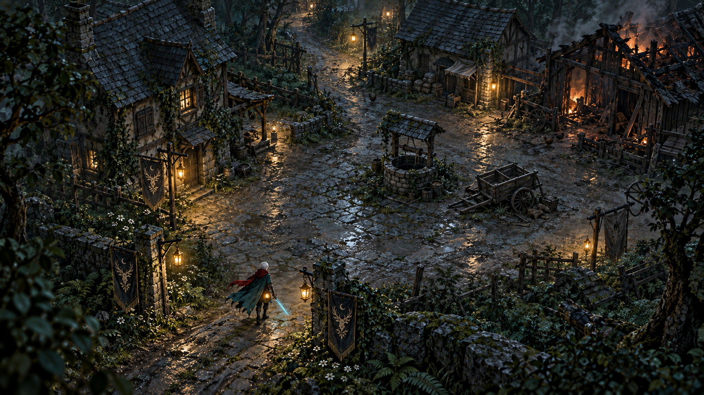

# 第二关「灰烬村庄」场景重设计

状态：概念图不是实机截图。第二关全地图已按此方向替换为专用建筑、道具、地面素材和曲折街巷，使用固定俯视镜头下的分层 2.5D 场景与现有 3D 角色。素材使用内置 imagegen 工具生成。

## 核心改变

以这张图的材质、比例与构图为目标，停止在原有整齐街网和简化房屋上叠加小装饰。村庄是雾林中的旧聚落：石路从林间延续进村，有生活痕迹，遭袭的建筑仍能辨认出原来的用途。冷月光和暖灯贯穿两关，变化来自空间和叙事。

## 第一段可玩场景：村口—水井广场—谷仓

入口位于南侧林道。两座旧石门柱、鹿纹旗与吊灯呼应封面。穿门后视野打开，左侧覆藤民居、中央偏北水井、右后方起火谷仓成为三个辨识点。水井周围形成环行路线，右侧有通向铁匠救援点的支路，北侧曲折小巷继续深入村庄。保持足够的近战与闪避空间，手推车和水井不堆在主要战斗通道上。

## 后续空间

| 区域 | 画面重点 | 玩法作用 |
| --- | --- | --- |
| 雾林村口 | 旧石门、挂旗、树根、湿路 | 两关衔接与初次遭遇 |
| 水井广场 | 不规则铺石、井台、木车、灯下民居 | 开阔战斗与方向辨认 |
| 谷仓侧院 | 残存瓦片、炭化梁柱、局部明火 | 救援铁匠、绕火进入侧门 |
| 押解庭院 | 阴冷围墙、牢笼、封闭后巷 | 村民救援与盾兵战斗 |
| 北方粮仓 | 麻袋、雨棚、运粮轨迹 | 关闭火油阀，保住粮食 |
| 北门空地 | 石墙、封路木障、军事旗帜 | 首领战与本关结算 |

## 美术制作要求

- 房屋轮廓分别制作：完整民居、商铺粮仓、受损谷仓。墙体有厚度，屋顶有挑檐、瓦片搭接、檐下阴影；门窗必须有凹陷和框架。不能依赖几何盒子配路面贴图来表现建筑。
- 采用石墙、抹灰、橡木、板岩各自的材质。苔藓在墙脚、阴面、缝隙生长；烟熏在受火区域。以结构和材质为主，避免用大量漂浮粒子代替细节。
- 道路按村庄空间绘制曲线与不规则边缘，石块尺度明显小于角色。泥土、碎石、草缝与浅积水自然过渡，取消铺满全场的整齐大砖网格。
- 树木、常春藤、蕨类组成前后层次。前景植被只框住边缘，不能遮挡敌人提示与玩家。
- 地面、建筑与人物采用同一方向主光与接触阴影。火焰只照亮附近梁柱和地面；用暖灯引导路线，保留画面暗部细节。

## 已实施的整关重建

- 14 处建筑换为四类独立美术素材：覆藤民居、烧毁谷仓、粮仓和守卫屋。建筑不再使用上一版简化几何墙体与屋顶。
- 采用固定俯视镜头下的预绘制建筑层、真实地面材质、动态角色和局部灯光。每座建筑独立定位、裁剪透明边缘、遮挡淡出和分块显示；没有把整张效果图当作游戏背景。
- 新增水井、木车、院墙、囚笼、粮食物资、林下植被。实体道具与建筑的碰撞来自同一份关卡数据。
- 道路改为两条曲折主路与五条连接巷道，带柔和边缘；五处庭院使用独立宽度与比例。小地图同步显示道路和建筑。
- 六段区域完整覆盖村口至北门，三个救援任务和首领战保留。第二关镜头前移，让路线和前方建筑更早进入视野。
- 现有存档若落在新建筑或道具内部，会迁移到附近可行走的位置；敌人的存档位置同样校正。
- 动态灯保持原来的三个槽位，在路灯和火源之间选取附近光源；建筑、植被、道具按区域显示，主要细节来自图集而非大量独立几何体。

## 验收重点

人工验收时应在同一镜头距离比较效果图与实机场景：建筑轮廓、角色比例、石块尺度、光照方向、材质层次是否一致。验证移动、攻击和屋顶淡出时无穿墙或遮挡；验证进入新区域时没有明显加载停顿。63 项自动测试通过，包含正常行动通关、救援点可达、旧存档校正、图集锚点与场景遮挡。未执行浏览器视觉验收或帧率实测，不将概念图视为实机品质证明。

## 生成提示词

工具：内置 imagegen。参考：public/og.png。

Use case: stylized-concept. Create a polished gameplay environment art target for chapter 2, Ashen Village, of the original dark medieval fantasy action RPG Nightward. The supplied image is STRICT STYLE AND HERO IDENTITY REFERENCE, not a composition to copy. Match its extraordinarily rich painterly-realistic game art, detailed weathered surfaces, teal blue forest mist, damp mossy stone, subtle golden lamplight, dark red fabric and believable scale. Create one cohesive wide 16:9 landscape illustration at high detail. IMPORTANT: elevated approximately 50 degree overhead three-quarter GAMEPLAY CAMERA, orthographic-like perspective, looking down at a small traversable village square and adjoining winding lane, no horizon, no sky, no distant castle panorama, no typography, no HUD, no border. This must look like an achievable premium dark fantasy RPG in-game environment art target, not a toy diorama, low-poly model or photograph. White-haired human swordsman from reference, teal travel cape, crimson scarf, leather armor, longsword and waist lantern, small at lower middle about 9 percent image height, walking into the village; do not make him huge or a portrait. World: first chapter forest road enters from bottom left through moss-covered ruined stone boundary posts with the reference's hanging brass lamps. At center is an irregular rain-wet cobbled open combat area with generous readable room to move; thin puddles reflect golden light. A battered stone well off-center and an abandoned wooden handcart tell of evacuation without obstructing the center. To left a detailed modest medieval timber and stone dwelling with a worn blue-gray slate roof, deep window recesses, visible individual roof slates, creeping ivy and a wooden shutter. Upper right a partly burned barn with believable broken roof rafters, sparse local amber flame and drifting smoke; next to it a surviving storehouse. A curving northbound lane opens between the buildings at upper center, suggesting the next objective. Outer edges framed with detailed old forest trees, ferns, mossy rocks, damp roots and restrained scattered leaves continuous with the reference forest. Avoid repeated identical houses, artificial geometric grids, giant regular pavement blocks, pasted photographic cutouts, simplified box buildings, unnaturally oversaturated orange fire, heavy blur, excessive particles or bloom. Lighting has unified cool blue-green diffuse moonlight and discreet warm pools at lamps and fire. Architectural and natural detail should be exceptionally fine but carefully composed, same visual language and fidelity as provided cover. This is a new chapter's gameplay scene concept, NOT an actual screenshot claim.

